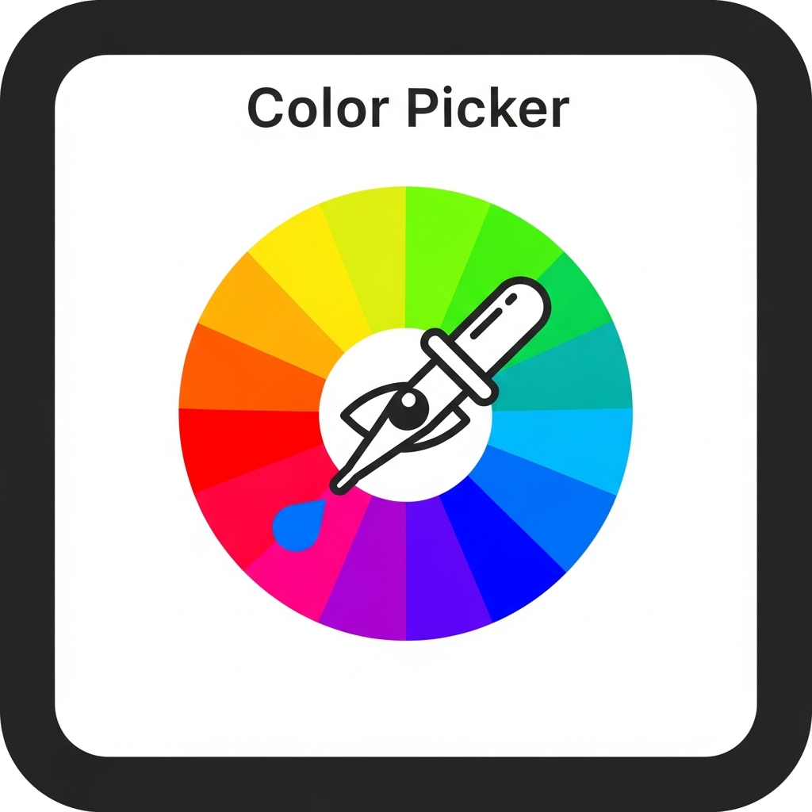
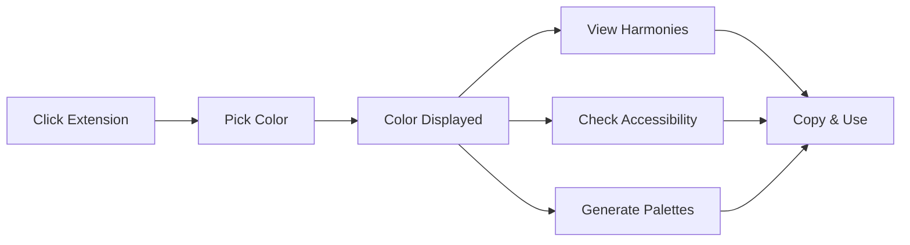
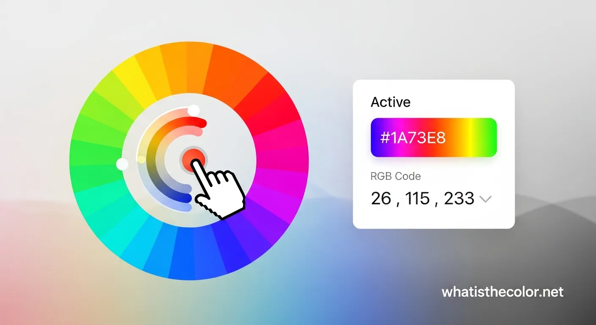
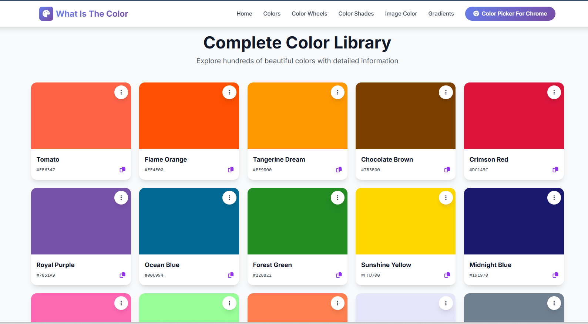
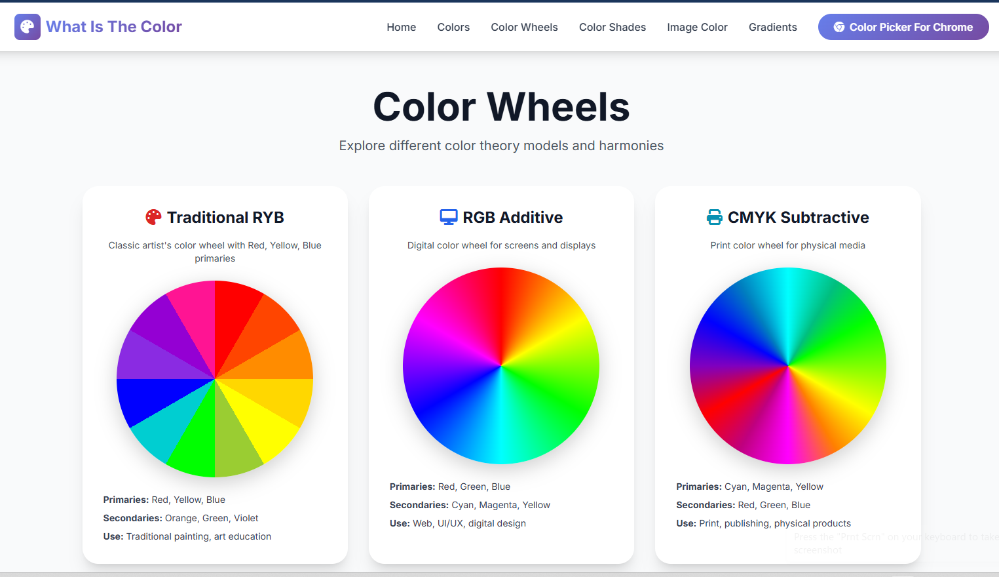
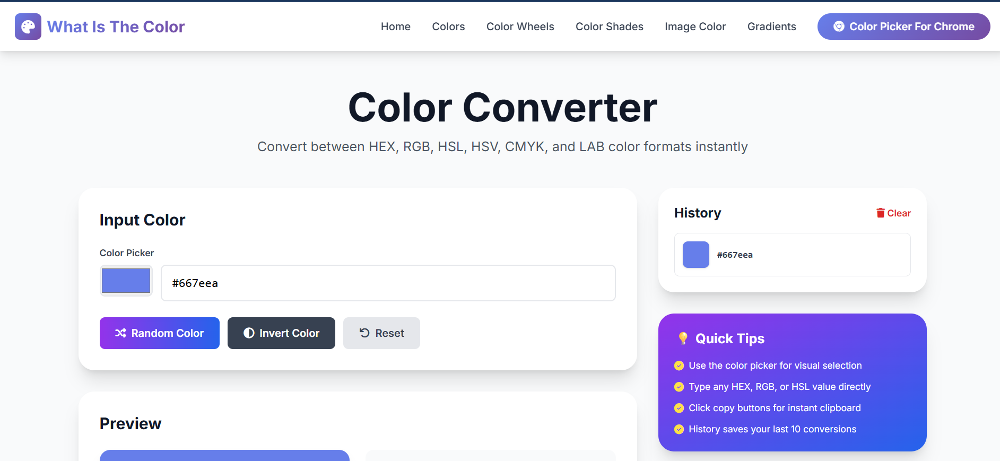
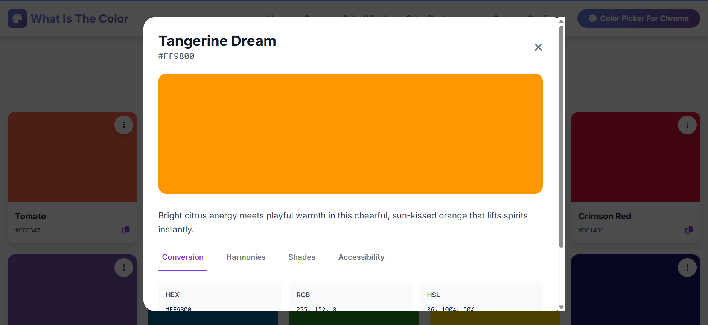

# 🎨 What Is The Color

[](https://chrome.google.com/webstore)
[](https://github.com/yourusername/ai-color-picker-pro)
[](LICENSE)
[](https://adilbalti.app)

> **Most advacne Color Picker Tool & Color Picker for Chrome Extension** - Pick colors, generate harmonies, check accessibility, and create AI-powered palettes instantly.

<p align="center">
  
</p>

---

## 📖 Table of Contents

- [Overview](#-overview)
- [Features](#-features)
- [Installation](#-installation)
- [Usage](#-usage)
- [Screenshots](#-screenshots)
- [Tech Stack](#-tech-stack)
- [Project Structure](#-project-structure)
- [Development](#-development)
- [Contributing](#-contributing)
- [Roadmap](#-roadmap)
- [License](#-license)
- [Author](#-author)
- [Support](#-support)

---

## 🌟 Overview

**What Is The Color** is not just another color picker - it's a complete color intelligence platform built into your browser. Designed for designers, developers, and creative professionals who work with colors daily.

### Why What Is The Color?

- **🎯 Universal Picking** - Extract colors from text, images, videos, backgrounds - anything visible
- **🤖 AI-Powered** - Smart palette generation and automatic color categorization
- **🌈 Professional Tools** - Color harmonies, accessibility checking, and 150+ color names
- **⚡ Lightning Fast** - Instant operations, works 100% offline
- **🔒 Privacy First** - Zero data collection, all processing local
- **💯 Free Forever** - No subscriptions, no premium tiers, all features included

---

## ✨ Features

### Core Functionality

#### 🎨 Universal Color Picking
```
• Pick colors from ANY element on screen
• Works on text, images, videos, and backgrounds
• Uses Chrome's native EyeDropper API
• Pixel-perfect color sampling
• One-click operation
```

#### 🏷️ Intelligent Color Recognition
```
• 150+ named colors database
• Smart approximation algorithm
• Human-friendly names (e.g., "Sky Blue")
• Easy team communication
• Professional color terminology
```

#### 📜 30-Color History
```
• Automatic color saving
• Persistent across sessions
• Visual grid layout
• Click to view details
• One-click clearing
```

### Advanced Features

#### 🤖 AI-Powered Smart Palettes

Automatically categorizes your colors into themed collections:

| Palette | Description | Use Case |
|---------|-------------|----------|
| 🔥 Warm Vibes | Reds, oranges, yellows | Energetic designs, CTAs |
| ❄️ Cool Tones | Blues, greens, purples | Calm, professional interfaces |
| ⚡ Vibrant | High-saturation colors | Attention-grabbing elements |
| 🌸 Pastel Dream | Soft, muted tones | Gentle, elegant designs |
| ⚫ Monochrome | Grayscale ranges | Typography, minimalist design |
| 🎨 Latest Picks | Recent selections | Current project colors |

#### 🌈 Professional Color Harmonies

Generate design-ready color schemes:

```javascript
Complementary  → 2 colors (opposite on the color wheel)
Triadic        → 3 colors (evenly spaced)
Analogous      → 3 colors (adjacent)
Monochromatic  → 3 colors (same hue, varied lightness)
Tetradic       → 4 colors (square pattern)
```

#### ♿ WCAG Accessibility Checker

Built-in contrast ratio calculator:

- **Tests against 4 backgrounds:** White, Black, Light Gray, Dark Gray
- **Shows exact ratios:** e.g., 7.2:1
- **AA Compliance:** 4.5:1 minimum (✓/✗)
- **AAA Compliance:** 7:1 minimum (✓/✗)
- **Live preview:** See actual text readability
- **WCAG 2.1 based:** Industry standard compliance

#### ⚙️ Customizable Settings

- **Auto-copy on pick** - Instant clipboard copy
- **Show color names** - Toggle names vs HEX
- **Uppercase HEX** - Format preference
- **Clear history** - Fresh start anytime
- **Persistent storage** - Settings survive restarts

### Multiple Color Formats

```
HEX   → #88B7DB
RGB   → rgb(136, 183, 219)
HSL   → hsl(203, 55%, 70%)
CMYK  → cmyk(38%, 16%, 0%, 14%)
```

### One-Click Copy

✅ Click any color value → Copied to clipboard  
✅ Click harmony color → Copied  
✅ Click "Copy All" → Entire palette copied  
✅ Visual feedback on every copy  

---

## 🚀 Installation

### Method 1: Chrome Web Store (Recommended)

> Coming Soon! Extension is currently in review.

1. Visit [Chrome Web Store](https://chromewebstore.google.com/detail/color-picker-for-chrome/lnlgdnmpnegfapinfpcmafpboclhijfj?authuser=0&hl=en)  
2. Click **Add to Chrome**
3. Click **Add Extension**
4. Start picking colors!

### Method 2: Manual Installation (Developer Mode)

#### Prerequisites
- Chrome 95+ or Edge 95+
- Git (optional)

#### Steps

1. **Clone or Download**
```bash
# Clone with git
git clone https://github.com/yourusername/ai-color-picker-pro.git

# Or download ZIP
# Download from GitHub → Extract to folder
```

2. **Open Chrome Extensions**
```
Navigate to: chrome://extensions/
```

3. **Enable Developer Mode**
```
Toggle: Developer mode (top-right corner)
```

4. **Load Extension**
```
Click: Load unpacked
Select: color-picker-extension folder
```

5. **Pin to Toolbar** (Optional)
```
Click: Extensions icon (puzzle piece)
Find: AI Color Picker Pro
Click: Pin icon
```

✅ **Ready!** Extension icon appears in toolbar.

---

## 💡 Usage

### Quick Start

1. **Click** the extension icon (🎨)
2. **Click** "Pick Color from Screen"
3. **Click** anywhere on screen to pick color
4. **View** color details, harmonies, and palettes!

### Basic Workflow



### Advanced Usage

#### Building a Brand Palette
```
1. Pick primary brand color
2. Go to Harmony tab
3. Select Triadic scheme
4. Copy all colors
5. Use as primary/secondary/accent
```

#### Ensuring Accessibility
```
1. Pick text color
2. Go to A11y tab
3. Check contrast ratios
4. Verify AA/AAA compliance
5. Adjust if needed
```

#### Matching Competitor Colors
```
1. Visit competitor site
2. Pick their brand colors
3. View in History tab
4. Generate similar harmonies
5. Create unique variation
```

### Keyboard Shortcuts

> Coming in future update

```
Alt + Shift + C  →  Quick pick
Alt + Shift + H  →  View history
Ctrl + C         →  Copy current color
```

---

## 📸 Screenshots

### Main Interface
<p align="center">
  
</p>

### Color Harmonies
<p align="center">
  
</p>

### Accessibility Checker
<p align="center">
  
</p>

### Smart Palettes
<p align="center">
  
</p>

### Settings Panel
<p align="center">
  
</p>

---

## 🛠️ Tech Stack

### Core Technologies
- **Manifest V3** - Latest Chrome extension standard
- **JavaScript (ES6+)** - Core logic and functionality
- **HTML5** - Popup interface structure
- **CSS3** - Custom styling (no frameworks)
- **Chrome APIs** - EyeDropper, Storage

### APIs Used
```javascript
chrome.storage.local    // Persistent data storage
EyeDropper API         // Color sampling
chrome.tabs            // Active tab access
chrome.action          // Extension popup
```

### Key Libraries
- **None!** - Zero external dependencies
- Vanilla JavaScript for maximum performance
- Native browser APIs only
- Custom CSS (no Tailwind/Bootstrap)

### Development Tools
- Python 3.x (for icon generation)
- PIL/Pillow (icon creation)
- Git (version control)

### Browser Support
| Browser | Minimum Version | Status |
|---------|----------------|--------|
| Chrome | 95+ | ✅ Fully Supported |
| Edge | 95+ | ✅ Fully Supported |
| Brave | Latest | ✅ Fully Supported |
| Opera | Latest | ✅ Fully Supported |

---

## 📁 Project Structure

```
ai-color-picker-pro/
├── 📄 manifest.json              # Extension configuration
├── 🎨 popup.html                 # Main UI (14KB with embedded CSS)
├── ⚙️ popup.js                   # Core functionality (18KB)
├── 🔧 background.js              # Service worker
├── 📝 content.js                 # Content script
├── 🖼️ icons/                     # Extension icons
│   ├── icon16.png               # 16x16 toolbar
│   ├── icon32.png               # 32x32 extensions page
│   ├── icon48.png               # 48x48 extensions page
│   └── icon128.png              # 128x128 web store
├── 🐍 create_icons.py            # Icon generator script
├── 📚 docs/                      # Documentation
│   ├── README.md                # This file
│   ├── QUICKSTART.md            # Quick installation guide
│   ├── FEATURES.md              # Detailed features
│   ├── SETTINGS.md              # Settings documentation
│   ├── TESTING.md               # Testing guide
│   └── CHANGELOG.md             # Version history
└── 📄 LICENSE                    # MIT License

Total: 17 files, ~100KB
```

### Key Files Explained

#### `manifest.json`
Extension configuration, permissions, and metadata.

#### `popup.html`
Main user interface with embedded CSS (no external dependencies).

#### `popup.js`
Core functionality including:
- Color picking logic
- Harmony generation algorithms
- Accessibility calculations
- AI palette generation
- Settings management

#### `background.js`
Service worker for extension lifecycle management.

#### `content.js`
Content script for page interaction (minimal usage).

---

## 🔧 Development

### Setup Development Environment

```bash
# Clone repository
git clone https://github.com/yourusername/ai-color-picker-pro.git
cd ai-color-picker-pro

# No dependencies to install! Pure vanilla JavaScript.

# Generate icons (if needed)
python create_icons.py
```

### Development Workflow

1. **Make Changes**
   - Edit `popup.html`, `popup.js`, or other files
   - Save changes

2. **Reload Extension**
   ```
   Go to: chrome://extensions/
   Find: AI Color Picker Pro
   Click: Reload icon (🔄)
   ```

3. **Test**
   - Click extension icon
   - Test functionality
   - Check console for errors (Right-click popup → Inspect)

4. **Debug**
   ```javascript
   // Console logs are added throughout popup.js
   console.log('Debug info here');
   ```

### Code Style

```javascript
// Use descriptive variable names
const currentColor = '#88B7DB';

// Functions are well-commented
function generateHarmonies(hex) {
  // Calculate color harmonies using HSL color space
  const rgb = hexToRgb(hex);
  // ...
}

// Constants at top of file
const colorNames = { /* ... */ };
```

### Testing

```bash
# Run all tests
See TESTING.md for comprehensive test checklist

# Quick smoke test
1. Pick a color
2. Check all 4 tabs
3. Copy a value
4. Toggle settings
```

### Building for Production

No build step required! Extension is production-ready as-is.

```bash
# Simply zip the folder
zip -r ai-color-picker-pro.zip color-picker-extension/

# Or use Chrome Developer Dashboard to upload
```

---

## 🤝 Contributing

Contributions are welcome! Please follow these guidelines:

### How to Contribute

1. **Fork the Repository**
   ```bash
   Click 'Fork' button on GitHub
   ```

2. **Create a Branch**
   ```bash
   git checkout -b feature/amazing-feature
   ```

3. **Make Changes**
   - Follow existing code style
   - Add comments for complex logic
   - Test thoroughly

4. **Commit Changes**
   ```bash
   git commit -m "Add amazing feature"
   ```

5. **Push to Branch**
   ```bash
   git push origin feature/amazing-feature
   ```

6. **Open Pull Request**
   - Describe your changes
   - Reference any related issues
   - Wait for review

### Contribution Guidelines

#### Code Standards
- Use vanilla JavaScript (no frameworks)
- Follow existing naming conventions
- Add comments for complex algorithms
- Keep functions focused and small
- No external dependencies

#### Commit Messages
```
feat: Add gradient generator
fix: Correct color name matching
docs: Update installation guide
style: Format code consistently
refactor: Simplify harmony calculation
test: Add accessibility tests
```

#### What to Contribute
✅ **Welcome:**
- Bug fixes
- Performance improvements
- New color formats
- UI enhancements
- Documentation improvements
- Test coverage

❌ **Please Avoid:**
- Adding external dependencies
- Changing core architecture
- Adding analytics/tracking
- Breaking changes without discussion

### Reporting Issues

Found a bug? Please report it!

**Include:**
- Description of the issue
- Steps to reproduce
- Expected behavior
- Actual behavior
- Chrome version
- Screenshots (if applicable)

**Example:**
```markdown
### Bug: Color name shows "undefined"

**Steps to reproduce:**
1. Pick a color #123456
2. Look at color name display

**Expected:** Should show color name or "Unknown Color"
**Actual:** Shows "undefined"

**Chrome Version:** 120.0.6099.129
```

---

## 🗺️ Roadmap

### Version 1.1.0 (Q1 2025)
- [ ] Export palettes to CSS/SCSS/JSON
- [ ] Keyboard shortcuts
- [ ] Color format switching (HEX/RGB/HSL toggle)
- [ ] Gradient generator
- [ ] Enhanced color history (tags, favorites)

### Version 1.2.0 (Q2 2025)
- [ ] Page color extraction (analyze entire webpage)
- [ ] Color blindness simulator
- [ ] Save favorite palettes
- [ ] Import/export settings
- [ ] Dark mode UI

### Version 2.0.0 (Q3 2025)
- [ ] Cloud sync (optional)
- [ ] Team collaboration features
- [ ] Figma plugin integration
- [ ] Adobe XD integration
- [ ] Advanced color manipulation tools

### Community Requested
- [ ] Custom color names database
- [ ] Batch color operations
- [ ] Color scheme templates
- [ ] Integration with design systems
- [ ] API for developers

**Vote on features:** [GitHub Discussions](#)

---

## 📄 License

This project is licensed under the **MIT License**.

```
MIT License

Copyright (c) 2024 Muhammad Adil Balti

Permission is hereby granted, free of charge, to any person obtaining a copy
of this software and associated documentation files (the "Software"), to deal
in the Software without restriction, including without limitation the rights
to use, copy, modify, merge, publish, distribute, sublicense, and/or sell
copies of the Software, and to permit persons to whom the Software is
furnished to do so, subject to the following conditions:

The above copyright notice and this permission notice shall be included in all
copies or substantial portions of the Software.

THE SOFTWARE IS PROVIDED "AS IS", WITHOUT WARRANTY OF ANY KIND, EXPRESS OR
IMPLIED, INCLUDING BUT NOT LIMITED TO THE WARRANTIES OF MERCHANTABILITY,
FITNESS FOR A PARTICULAR PURPOSE AND NONINFRINGEMENT. IN NO EVENT SHALL THE
AUTHORS OR COPYRIGHT HOLDERS BE LIABLE FOR ANY CLAIM, DAMAGES OR OTHER
LIABILITY, WHETHER IN AN ACTION OF CONTRACT, TORT OR OTHERWISE, ARISING FROM,
OUT OF OR IN CONNECTION WITH THE SOFTWARE OR THE USE OR OTHER DEALINGS IN THE
SOFTWARE.
```

See [LICENSE](LICENSE) file for full details.

---

## 👨‍💻 Author

**Muhammad Adil Balti**

- 🌐 Website: [https://whatisthecolor.net/](https://whatisthecolor.net/)
- 💼 LinkedIn: [Muhammad Adil Balti](https://www.linkedin.com/in/muhammad-adil-balti)
- 🐦 Twitter: [@adilbalti](https://twitter.com/adil_2929)
- 📧 Email: [your.email@example.com](mailto:your.email@example.com)
- 🎯 GitHub: [@Adil512](https://github.com/Adil512)

### Other Projects

- **whatismyfaceshape.net** - AI-Powered Face Shape Detection Tool
- **xmlsitemaps.app** - XML sitemap generator
- **countrycode.io** - Country code directory
---

## 💬 Support

### Get Help

- 📖 **Documentation:** Check the [docs](docs/) folder
- 🐛 **Bug Reports:** [Open an issue](https://github.com/yourusername/ai-color-picker-pro/issues)
- 💡 **Feature Requests:** [GitHub Discussions](#)
- 📧 **Email Support:** [your.email@example.com](mailto:your.email@example.com)

### FAQ

**Q: Does this work offline?**  
A: Yes! 100% offline functionality. No internet required.

**Q: Do you collect any data?**  
A: No! Zero data collection. Everything stays on your device.

**Q: Why do you need "all URLs" permission?**  
A: To pick colors from any website you visit. The permission is only used when you click the pick button.

**Q: Can I use this commercially?**  
A: Yes! MIT license allows commercial use.

**Q: How do I report a bug?**  
A: Open an issue on GitHub with details and screenshots.

**Q: Can I contribute?**  
A: Absolutely! See [Contributing](#-contributing) section.

---

## ⭐ Show Your Support

If you find this extension useful:

- ⭐ **Star this repository** on GitHub
- 🐦 **Share** on social media
- 📝 **Write a review** on Chrome Web Store
- 🤝 **Contribute** code or documentation
- ☕ **Buy me a coffee** (link coming soon)

Every star helps others discover this tool!

---

## 🙏 Acknowledgments

- **Chrome Team** - For the EyeDropper API
- **W3C** - For color science specifications
- **Design Community** - For feedback and suggestions
- **Open Source Community** - For inspiration and support

---

## 📊 Stats


---

<p align="center">
  <strong>Made with ❤️ for designers and developers worldwide</strong>
</p>

<p align="center">
  <a href="#-table-of-contents">Back to Top ↑</a>
</p>

---

**© 2024 Muhammad Adil Balti. All rights reserved.**
